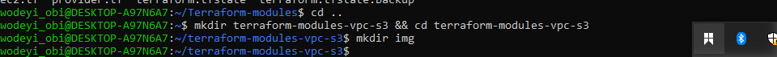

# 🚀 Terraform Modules – VPC and S3 Bucket with Backend Storage

## 📘 Project Overview

This mini project demonstrates how to create **modular Terraform configurations** to provision:
- An Amazon Virtual Private Cloud (VPC)
- An Amazon S3 bucket

Additionally, you'll configure Terraform to use the **S3 bucket as backend storage** for state management, promoting better collaboration and infrastructure consistency.

---

## 🎯 Objectives

1. **Terraform Modules**: Learn to create reusable and customizable Terraform modules.
2. **VPC Creation**: Build a VPC module with configurable CIDR block and subnets.
3. **S3 Bucket Creation**: Develop an S3 bucket module with customizable name and ACL.
4. **Backend Storage**: Configure Terraform to use Amazon S3 for storing the state file.

---

## 📂 Project Structure

terraform-module-VPC-s3/
├── main.tf
├── backend.tf
├── variables.tf
├── outputs.tf
│
└── modules/
├── vpc/
│ ├── main.tf
│ ├── variables.tf
│ └── outputs.tf
│
└── s3/
├── main.tf
├── variables.tf
└── outputs.tf

markdown
Copy
Edit

---

## 🛠️ Tasks

### ✅ Task 1: VPC Module
- Create a `modules/vpc` directory.
- Write a VPC module (`main.tf`, `variables.tf`, `outputs.tf`) to accept inputs like CIDR block and subnets.
- Reference the module from the root `main.tf`.




### ✅ Task 2: S3 Bucket Module
- Create a `modules/s3` directory.
- Write an S3 module (`main.tf`, `variables.tf`, `outputs.tf`) to accept bucket name, ACL, etc.
- Reference the module from the root `main.tf`.


### ✅ Task 3: Backend Configuration
- Configure Terraform to store the state file in an S3 bucket using `backend.tf`.


---

## ⚙️ Setup Instructions

### ✅ Prerequisites
- AWS CLI installed and configured (`aws configure`)
- Terraform installed (v1.0+ recommended)
- Existing S3 bucket and (optional) DynamoDB table for remote backend

### 🔐 Configure AWS Credentials
```bash
aws configure
🧾 Edit Variables and Backend
Update variables.tf with your desired values.

Replace placeholders in backend.tf:

```


bucket      ="your-terraform-state-bucket"

key            = "terraform.tfstate"

region         = "us-east-1"

dynamodb_table = "your-lock-table"

🚀 Usage

1. Initialize the Project

- terraform init


2. Validate the Configuration

- terraform validate


3. Preview the Changes

- terraform plan


4. Apply the Configuration


- terraform apply


📌 Notes

- Ensure your S3 bucket and (optional)

- DynamoDB table exist before initializing Terraform.

- Use terraform destroy to tear down
resources when you're done (for cost control).

📚 Learning Focus


This project is designed as a hands-on learning opportunity to:

Understand and apply Terraform module best practices

Gain experience with backend state management using S3

Build scalable and reusable cloud infrastructure


